# Visual Editor 📐


🚀 App:  https://visual-editor-ten.vercel.app/

🎬 Demo: https://drive.google.com/file/d/13toVHPDH2mqbx5GR5HrwTRA7GaTo2dvD/view?usp=drivesdk

Features:

1. ✅ Add at least one of each of 3 shape types to the editor area.
2. ✅ Move any of the shapes freely both vertically and horizontally.
3. ✅ Activate the “Closest point” tool and see the highlighted points follow the mouse cursor as it moves.
4. ✅ State manager integrated with drawing engine (ThreeJS)
5. ✅ Serialization of state (auto-save to local storage after 10s) and reload on page refresh

## 📝 Notes

Main parts:

1. [editor](./src/components/editor/index.tsx) - where everything is bundled together
2. [drawing](src/components/drawing) --- the area where shape live,
   and [drawables](src/components/engine/drawable/hooks)
   --- shapes painted in that area --- are the abstractions for the drawing logic
3. [engine](./src/components/engine) - concrete implementation with ThreeJS for `drawing` and `drawable` abstractions
   a `DrawableProto` gets converted into a final `Mesh` (see [shapes](./src/components/engine/drawable/shapes))
   and [hooks](./src/components/engine/drawable/hooks) for all the meaty logic
4. [store](./src/store/slices/drawables.tsx) - contains the state manager responsible for converting actions from within
   the drawing
   or outside the drawing (editor buttons) into changes for the drawables

Updates:

1. support for closest point tool. Relevant files:
    1. 2d algorithm: [source file](src/components/drawing/closest-point/index.ts)
       and [spec file](src/components/drawing/closest-point/unit.spec.ts)
    2. factory for creating the closest points for each
       drawable [source](./src/components/engine/drawable/smart-shapes/closest-point);
       these are destroyed when the editor does not need to display them
    3. [closest point shape](src/components/engine/drawable/smart-shapes/closest-point/closest-point.tsx)
    4. debug for mouse tracking: [tracker.ts](src/components/engine/drawable/smart-shapes/tracker.tsx) available when
       adding `?debug` to the URL
2. fix the shape movement snap when dragging
    1. due to not understanding how the `useDrag` utility works


High Level Architecture

```mermaid
sequenceDiagram
    participant MouseEvent as MouseEvent 🖱️
    participant EditorButtons as EditorButtons ⏏️
    participant Drawing as Drawing ☐
    participant Store as Store 🗄️
    participant DrawingThreeJS as ThreeJS 🖼️
   
    MouseEvent-->>EditorButtons: ⚡clickButton() 
    EditorButtons-->>Store: dispatch(setDragableItems)
    Store->>Store: update(drawables)
    Store-->>Drawing: select(drawables)
    Drawing->>DrawingThreeJS: render(drawables)
    DrawingThreeJS->>DrawingThreeJS: renderFrame()
    MouseEvent-->>DrawingThreeJS: ⚡click(point2d)
    DrawingThreeJS->>Store: dispatch(mouseClickEvent(point3d))
    Store->>Store: update(drawables)
    Store-->>Drawing: select(drawables)
    Drawing->>DrawingThreeJS: render(drawables)
    DrawingThreeJS->>DrawingThreeJS: renderFrame()
```



General principles:

1. create UI components that are as dumb as possible (see https://www.componentdriven.org/)
2. all behavior is extracted into React hooks that can be composed together;
   hooks are closely tied to a component (by having a similar name and providing all the necessary props)
3. we used as much as possible the wrappers around ThreeJS objects provided by `react-three-fiber` and `drei`
4. we started without a state manager and added later on once the data patterns emerged

## 🚧 Limitations

- [ ] TODOs are scattered throughout the codebase
- [ ] `ts-ignore` is used in more than a few places
- [ ] when dragging the shapes there is a big offset added sometimes
- [ ] `ThreeJS` is dealing mostly with 3d and using it on 2d introduces some issues:
  (camera positions, 3d -> 2d and back positioning, click handlers, distance handlers, etc.)
- [ ] `userData` attached on the mesh/scene needs to be more aligned with state manager
- [ ] performance concerns with how state manager changes are triggering unnecessary re-renders;
  the glue code provided by `react-three-fiber` is a bit of a black box

## 🏗️ Tech Stack

- [Next.js](https://nextjs.org/)
- [Storybook](https://storybook.js.org/) and [Chromatic](https://www.chromatic.com/)
- [React Material UI](https://material-ui.com/)
- [Redux Toolkit](https://redux-toolkit.js.org/)
- [ThreeJS](https://threejs.org/)
  with [react-three-fiber](https://docs.pmnd.rs/react-three-fiber/getting-started/introduction)
  and [drei](https://github.com/pmndrs/drei)

## 🧑‍💻 Dev Installation Notes

### Install Dependencies

```bash
npm ci
```

### Quick Setup

First, run the development server:

```bash
npm run dev
```

Open [http://localhost:3000](http://localhost:3000) with your browser to see the result.

### Storybook

```bash
npm run storybook
```

Then open [http://localhost:6006](http://localhost:6006) with your browser to see the result.
A sample page can been seen [here](./doc/img/storybook/library.png).

## 🤖 Testing

We use the following test types:

1. unit (via Jest) ([sample](./src/components/engine/drawing/unit.spec.tsx))
2. integration (`react-testing-library` style)([sample](./src/components/engine/drawing/unit.spec.tsx))
3. smoke (via Storybook)
4. interaction/e2e (via Storybook)([sample](./src/components/editor-buttons/component.stories.tsx))
5. visual regression (via Chromatic)([sample](./doc/img/storybook/visual-regression.png))

```bash
npm run test-unit
```

```bash
npm run test-storybook
```

```bash
npm run chromatic
```

## 🌎 Deployed on Vercel and Chromatic

The `main` branch is synced with https://visual-editor-ten.vercel.app/.

The `main` branch Storybook assets are synced with https://www.chromatic.com/builds?appId=15626db33831.
Snapshot of the page can be seen [here](./doc/img/storybook/dashboard.png).